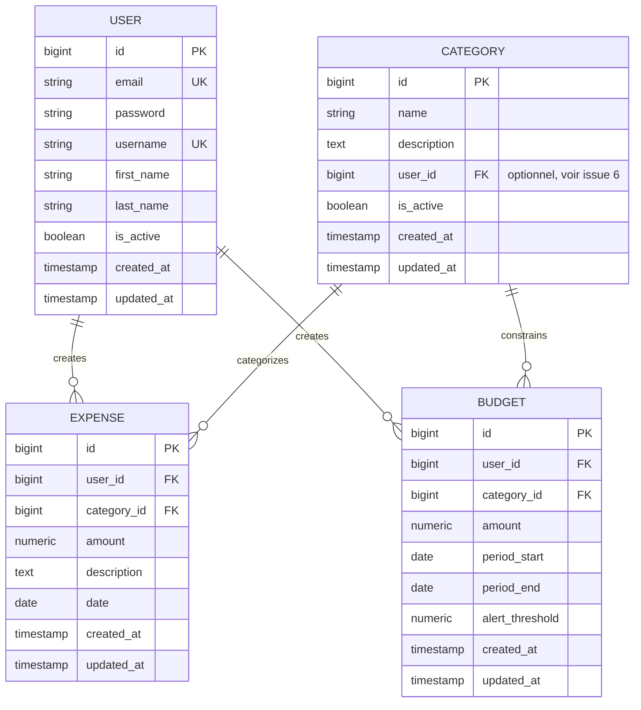

# Entity-Relationship Diagram (ERD) — Cashmire

> **PROPOSITION EN ATTENTE D'APPROBATION**
> 
> Ce document décrit l'ERD proposée pour Cashmire. Il **ne constitue pas** une décision finale. Avant la rédaction des migrations Django et la création des modèles, cette proposition doit être approuvée par l'équipe. Voir `docs/specs/issue-5-erd.md` pour le détail complet.

---

## Diagramme de relations



**Légende :**
- `PK` = Primary Key (clé primaire)
- `FK` = Foreign Key (clé étrangère)
- `UK` = Unique Key (unicité)
- `||--o{` = One-to-Many (1:N)
- `||--||` = One-to-One (1:1)

---

## Spécification détaillée des entités

### USER — Utilisateurs

| Champ | Type | Contraintes | Description |
|-------|------|-----------|------------|
| `id` | `BIGSERIAL` | PRIMARY KEY | Clé primaire auto-incrémentée. Django `BigAutoField`. |
| `email` | `VARCHAR(254)` | UNIQUE, NOT NULL | Adresse email unique. Utilisée pour la connexion. |
| `password` | `VARCHAR(255)` | NOT NULL | Hash du mot de passe (généré par Django). Jamais en clair. Aligné avec Django User par défaut. |
| `username` | `VARCHAR(150)` | UNIQUE, NOT NULL | Nom d'utilisateur unique pour login ou affichage. |
| `first_name` | `VARCHAR(150)` | NULL | Prénom optionnel. |
| `last_name` | `VARCHAR(150)` | NULL | Nom de famille optionnel. |
| `is_active` | `BOOLEAN` | NOT NULL, DEFAULT true | Indicateur de compte actif. Soft-delete via désactivation. |
| `created_at` | `TIMESTAMP` | NOT NULL, DEFAULT now() | Horodatage de création du compte. |
| `updated_at` | `TIMESTAMP` | NOT NULL, DEFAULT now() | Horodatage de dernière modification. |

**Indices suggérés :**
- Index sur `email` (pour les logins)
- Index sur `username` (pour les requêtes de recherche utilisateur)

---

### CATEGORY — Catégories de dépenses

| Champ | Type | Contraintes | Description |
|-------|------|-----------|------------|
| `id` | `BIGSERIAL` | PRIMARY KEY | Clé primaire auto-incrémentée. |
| `name` | `VARCHAR(100)` | NOT NULL | Nom de la catégorie (ex. « Alimentation », « Transport »). |
| `description` | `TEXT` | NULL | Description optionnelle pour la catégorie. |
| `user_id` | `BIGINT` | FK → USER.id (optionnel) | **POINT OUVERT (issue #6) :** Structure flexible pour supporter deux modèles possibles. Voir section « Modèles conditionnels » ci-dessous. |
| `is_active` | `BOOLEAN` | NOT NULL, DEFAULT true | Indicateur de catégorie active. |
| `created_at` | `TIMESTAMP` | NOT NULL, DEFAULT now() | Horodatage de création. |
| `updated_at` | `TIMESTAMP` | NOT NULL, DEFAULT now() | Horodatage de dernière modification. |

**Indices suggérés :**
- Index sur `name` (requêtes de recherche)
- Index sur `user_id` si catégories scoped (voir section « Modèles conditionnels »)
- Index unique sur `(user_id, name)` ou simple index sur `name` selon le modèle choisi

---

### EXPENSE — Dépenses

| Champ | Type | Contraintes | Description |
|-------|------|-----------|------------|
| `id` | `BIGSERIAL` | PRIMARY KEY | Clé primaire auto-incrémentée. |
| `user_id` | `BIGINT` | FK → USER.id, NOT NULL | Propriétaire de la dépense. Chaque dépense appartient à un utilisateur. |
| `category_id` | `BIGINT` | FK → CATEGORY.id, NOT NULL | Catégorie de la dépense. Chaque dépense a exactement une catégorie. |
| `amount` | `NUMERIC(10, 2)` | NOT NULL, CHECK(amount > 0) | Montant de la dépense. **Obligatoirement NUMERIC, jamais float ou double.** Peut stocker jusqu'à 99999999.99. Contrainte : montant strictement positif. |
| `description` | `TEXT` | NULL | Description optionnelle de la dépense. |
| `date` | `DATE` | NOT NULL | Date de la dépense (peut différer de `created_at` pour enregistrement rétroactif). |
| `created_at` | `TIMESTAMP` | NOT NULL, DEFAULT now() | Horodatage de création en base (métadonnée système). |
| `updated_at` | `TIMESTAMP` | NOT NULL, DEFAULT now() | Horodatage de dernière modification. |

**Indices suggérés :**
- Index sur `user_id` (pour lister les dépenses d'un utilisateur)
- Index sur `(user_id, date)` ou `(user_id, category_id, date)` (pour filtres combinés et agrégations)
- Index sur `date` (pour les requêtes par plage de dates)

**Contraintes d'intégrité :**
- `amount > 0` (via CHECK SQL, appliqué à la base de données)
- FK `user_id` → `USER(id)` avec CASCADE on DELETE (si un utilisateur est supprimé, ses dépenses le sont aussi)
- FK `category_id` → `CATEGORY(id)` (avec RESTRICT ou SET NULL selon la politique de suppression de catégories)

---

### BUDGET — Budgets

| Champ | Type | Contraintes | Description |
|-------|------|-----------|------------|
| `id` | `BIGSERIAL` | PRIMARY KEY | Clé primaire auto-incrémentée. |
| `user_id` | `BIGINT` | FK → USER.id, NOT NULL | Propriétaire du budget. Chaque budget appartient à un utilisateur. |
| `category_id` | `BIGINT` | FK → CATEGORY.id, NOT NULL | Catégorie couverte par le budget. Chaque budget s'applique à une catégorie. |
| `amount` | `NUMERIC(10, 2)` | NOT NULL, CHECK(amount > 0) | Montant budgété (limite). **Obligatoirement NUMERIC, jamais float.** Contrainte : montant strictement positif. |
| `period_start` | `DATE` | NOT NULL | Début de la période budgétaire (ex. 2026-01-01). |
| `period_end` | `DATE` | NOT NULL, CHECK(period_end >= period_start) | Fin de la période budgétaire (ex. 2026-01-31). Contrainte : la fin doit être >= au début. |
| `alert_threshold` | `NUMERIC(5, 2)` | NULL, DEFAULT 80.00, CHECK(alert_threshold BETWEEN 0 AND 100) | Seuil d'alerte en pourcentage (ex. 80 = 80 %). Optionnel. Déclenche une alerte quand les dépenses dépassent ce seuil. Implémentation de la logique dans future issue. Contrainte : valeur entre 0 et 100. |
| `created_at` | `TIMESTAMP` | NOT NULL, DEFAULT now() | Horodatage de création. |
| `updated_at` | `TIMESTAMP` | NOT NULL, DEFAULT now() | Horodatage de dernière modification. |

**Indices suggérés :**
- Index sur `user_id` (pour lister les budgets d'un utilisateur)
- Index sur `(user_id, period_start, period_end)` (pour requêtes par plage de dates)

**Contraintes composées :**

```sql
UNIQUE (user_id, category_id, period_start, period_end)
```

Un seul budget par (utilisateur, catégorie, période). Empêche les budgets en doublon.

**Contraintes d'intégrité :**
- `amount > 0` (via CHECK SQL)
- `period_start <= period_end` (via CHECK SQL, appliqué à la base de données)
- `alert_threshold` entre 0 et 100 (via CHECK SQL si non NULL)
- FK `user_id` → `USER(id)` avec CASCADE on DELETE
- FK `category_id` → `CATEGORY(id)` avec RESTRICT (ne pas supprimer une catégorie tant qu'elle a des budgets actifs)

---

## Relations et cardinalités

| Relation | Cardinalité | Sens | Description |
|----------|-------------|------|------------|
| `USER` → `EXPENSE` | 1:N | Un utilisateur crée plusieurs dépenses (zéro ou plus). Une dépense appartient à exactement un utilisateur. | Join: `EXPENSE.user_id = USER.id` |
| `USER` → `BUDGET` | 1:N | Un utilisateur crée plusieurs budgets (zéro ou plus). Un budget appartient à exactement un utilisateur. | Join: `BUDGET.user_id = USER.id` |
| `USER` ↔ `CATEGORY` | **À définir (issue #6)** | Voir section « Modèles conditionnels » ci-dessous. | Deux scénarios possibles. |
| `CATEGORY` → `EXPENSE` | 1:N | Une catégorie peut avoir plusieurs dépenses (zéro ou plus). Une dépense appartient à exactement une catégorie. | Join: `EXPENSE.category_id = CATEGORY.id` |
| `CATEGORY` → `BUDGET` | 1:N | Une catégorie peut avoir plusieurs budgets (ex. un par mois). Un budget s'applique à exactement une catégorie. | Join: `BUDGET.category_id = CATEGORY.id` |

---

## Modèles conditionnels — Issue #6 (Ownership des catégories)

### Le point ouvert

La relation entre `USER` et `CATEGORY` **n'est pas tranchée dans cette spécification**. Deux approches sont possibles ; l'équipe doit choisir l'une avant la rédaction des migrations.

### Scénario A : Catégories partagées

Une seule liste de catégories globale, commune à tous les utilisateurs.

**Structure `CATEGORY` :**
```sql
CREATE TABLE category (
    id BIGSERIAL PRIMARY KEY,
    name VARCHAR(100) NOT NULL,
    description TEXT,
    -- user_id absent ou NULL
    is_active BOOLEAN NOT NULL DEFAULT true,
    created_at TIMESTAMP NOT NULL DEFAULT now(),
    updated_at TIMESTAMP NOT NULL DEFAULT now(),
    UNIQUE (name)
);
```

**Avantages :**
- Moins de données en base.
- Plus simple pour les requêtes globales.
- Tous les utilisateurs partagent une nomenclature unique.

**Inconvénients :**
- Moins flexible : les utilisateurs ne peuvent pas personnaliser leurs catégories.
- Scalabilité : gestion centralisée des catégories peut devenir compliquée.

**API correspondante :**
- GET `/api/categories/` : liste les catégories globales
- POST `/api/categories/` : admin crée une catégorie globale

### Scénario B : Catégories scoped par utilisateur

Chaque utilisateur dispose de sa propre liste de catégories.

**Structure `CATEGORY` :**
```sql
CREATE TABLE category (
    id BIGSERIAL PRIMARY KEY,
    user_id BIGINT NOT NULL,
    name VARCHAR(100) NOT NULL,
    description TEXT,
    is_active BOOLEAN NOT NULL DEFAULT true,
    created_at TIMESTAMP NOT NULL DEFAULT now(),
    updated_at TIMESTAMP NOT NULL DEFAULT now(),
    FOREIGN KEY (user_id) REFERENCES "user" (id) ON DELETE CASCADE,
    UNIQUE (user_id, name)
);

CREATE INDEX idx_category_user_id ON category(user_id);
```

**Avantages :**
- Plus flexible : chaque utilisateur personnalise ses catégories.
- Meilleure séparation des données par utilisateur.

**Inconvénients :**
- Plus de données en base.
- Requêtes plus complexes (besoin de filtres `WHERE user_id = ?`).
- Permissions à gérer : un utilisateur ne peut voir que ses propres catégories.

**API correspondante :**
- GET `/api/users/{user_id}/categories/` : liste les catégories d'un utilisateur
- POST `/api/users/{user_id}/categories/` : l'utilisateur crée ses catégories

### Implémentation actuelle (provisoire)

Le diagramme Mermaid ci-dessus **n'inclut pas** la relation `USER` ↔ `CATEGORY` pour refléter cette ambiguïté ouverte.

Dans le tableau `CATEGORY`, la colonne `user_id` est marquée comme **(optionnel)**, ce qui indique que sa présence ou absence dépend de la décision sur issue #6.

---

## Champs monétaires et précision

Tous les champs de montants (`amount` sur `EXPENSE` et `BUDGET`) sont **obligatoirement `NUMERIC(10, 2)`** en PostgreSQL, jamais `float` ou `double precision`.

```sql
-- ✓ CORRECT
amount NUMERIC(10, 2) NOT NULL CHECK (amount > 0)

-- ✗ FAUX — ne pas faire
amount FLOAT
amount DOUBLE PRECISION
```

**Justification :** Évite les erreurs d'arrondi IEEE 754. Ex. 0.1 + 0.2 = 0.30000000000000004 en float ; en NUMERIC c'est exactement 0.30.

**Contraintes explicites en base :**
- `CHECK (amount > 0)` appliqué directement à la colonne pour rejeter les montants négatifs ou nuls à la base de données.
- Valide à la fois à la couche application et à la couche base de données (défense en profondeur).

---

## Période budgétaire

Les budgets utilisent deux colonnes `period_start` et `period_end` (dates exactes) au lieu d'une enum de mois.

**Avantage :** Support de périodes arbitraires (ex. 1er au 30 de chaque mois, ou semaines, ou trimestres).

**Inconvénient :** Requêtes de matching `EXPENSE.date BETWEEN BUDGET.period_start AND BUDGET.period_end` plus coûteuses.

**Contrainte explicite en base :**
- `CHECK (period_end >= period_start)` appliqué directement sur la table pour garantir la validité logique des périodes.
- Valide à la base de données, indépendamment de la couche application.

**Compromis MVP :** La flexibilité gagne pour l'MVP. Si performance devient un problème, reconsidérer avec indices et partitioning.

---

## Décisions de conception

### 1. BigAutoField pour les clés primaires

Django 3.2+ utilise `BigAutoField` par défaut (`DEFAULT_AUTO_FIELD = "django.db.models.BigAutoField"` dans `settings.py`). Tous les `id` sont `BIGSERIAL` (64 bits) plutôt que `SERIAL` (32 bits).

**Impact :** Supporte jusqu'à ~9 milliards d'enregistrements par table sans débordement.

### 2. Timestamps implicites (`created_at`, `updated_at`)

Chaque entité a `created_at` et `updated_at`.

- `created_at` : ne change jamais après insertion.
- `updated_at` : mis à jour à chaque modification (update automatique dans une trigger ou via ORM).

**Implémentation Django :** Utiliser `DateTimeField(auto_now_add=True)` pour `created_at` et `DateTimeField(auto_now=True)` pour `updated_at`.

### 3. Soft-delete via `is_active` (partiel)

`USER` et `CATEGORY` ont un booléen `is_active`.

**But :** Désactiver un utilisateur ou une catégorie sans supprimer physiquement les données.

**Note :** `EXPENSE` et `BUDGET` n'ont pas de colonne `is_active` (MVP : suppression logique pas requise pour les transactions).

**Limitation connue :** Cette approche partielle peut mener à des incohérences (ex. une dépense avec une catégorie `is_active = false`). Documenter dans les futures décisions.

### 4. Pas de type JSONB (MVP)

Les entités utilisent des colonnes scalaires (string, int, numeric, date, timestamp) pour la simplicité.

**Pas de :** champs d'attributs flexibles, métadonnées JSON, tags. Ils arrivent quand les besoins l'exigent.

### 5. Indices et performance

Les indices suggérés ci-dessus sont des recommandations pour les requêtes courantes (lister les dépenses d'un utilisateur, filtrer par période, etc.).

**À appliquer lors de la rédaction des migrations.** Ne pas sur-indexer : chaque index ralentit les inserts/updates.

---

## Cohérence avec le code existant

- **Base de données PostgreSQL :** `settings.py` définit `DATABASES["default"]["ENGINE"] = "django.db.backends.postgresql"`. Cet ERD utilise le dialecte PostgreSQL (`NUMERIC`, `BIGSERIAL`, `TIMESTAMP`, etc.) compatible avec la configuration existante.
- **DEFAULT_AUTO_FIELD :** Django est configuré avec `DEFAULT_AUTO_FIELD = "django.db.models.BigAutoField"` dans `settings.py`. Tous les `id` utilisent `BIGSERIAL` par cohérence.
- **User par défaut Django :** Pas d'héritage multi-table personnalisé. Utilisation de Django `User` de base pour `USER` (champ `password` au lieu de `password_hash`).
- **Pas de modèles existants :** `backend/api/` ne contient pas de `models.py` aujourd'hui. Cet ERD propose les quatre premiers modèles du projet.
- **Migration 0001 vide :** `backend/api/migrations/0001_initial.py` est actuellement vide (`operations = []`). Les vrais modèles seront introduits dans `0002_initial_models.py` ou équivalent.

---

## Prochaines étapes

1. **Approbation de cette proposition :** Équipe lit et approuve (ou amende) l'ERD.
2. **Résolution de l'issue #6 :** Trancher sur l'ownership des catégories (voir section « Modèles conditionnels »).
3. **Rédaction des décisions :** Documenter le choix effectué pour issue #6 dans `docs/decisions/`.
4. **Création des modèles Django :** `backend/api/models.py` implémente la structure validée.
5. **Migrations initiales :** `backend/api/migrations/0002_initial_models.py` ou équivalent.
6. **Spécifications API :** Issues futures pour les routes CRUD.

---

## Références

- **Spec complète :** `docs/specs/issue-5-erd.md`
- **Configuration Django :** `backend/cashmire/settings.py` (`DEFAULT_AUTO_FIELD`, `DATABASES`)
- **Migration initiale :** `backend/api/migrations/0001_initial.py` (actuellement vide)
- **Workflow :** `docs/git-workflow.md`, `docs/agentic-log.md`

---

*Dernière mise à jour : 2026-10-06. Document proposé par Product & Architecture. En attente d'approbation.*
